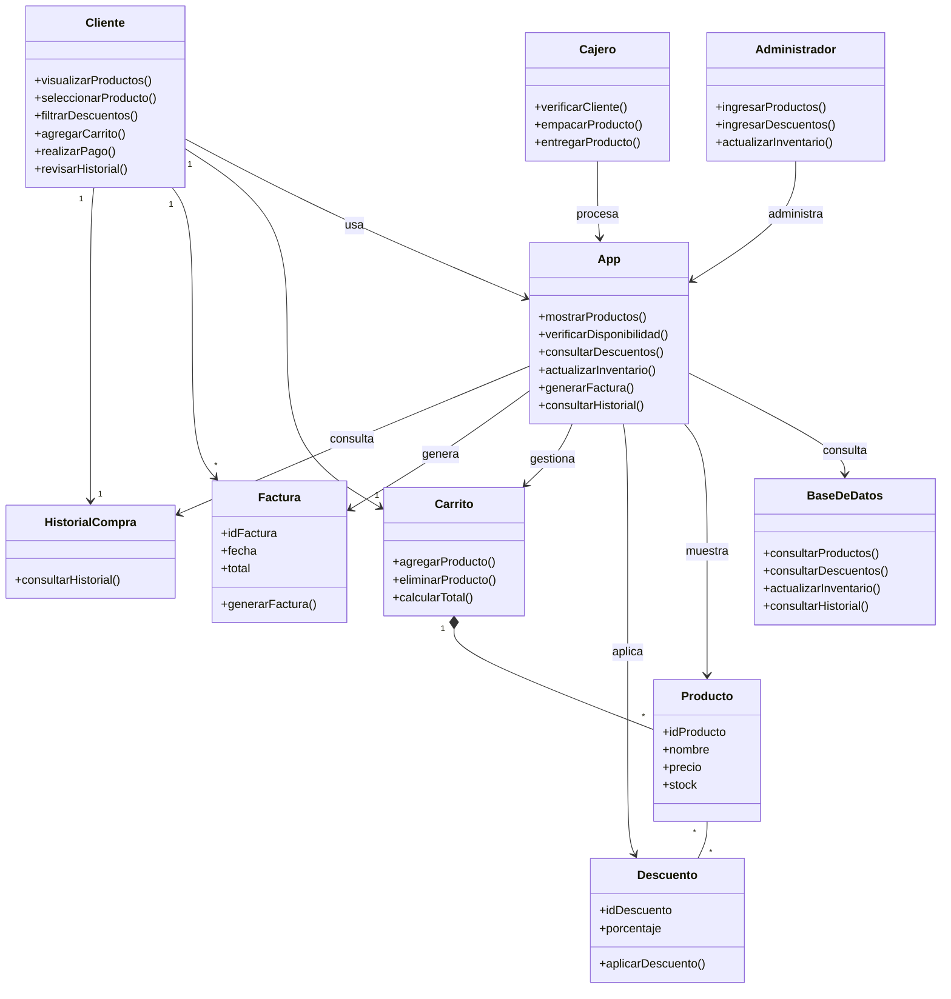

```mermaid
classDiagram

class Cliente{
    +visualizarProductos()
    +seleccionarProducto()
    +filtrarDescuentos()
    +agregarCarrito()
    +realizarPago()
    +revisarHistorial()
}

class App{
    +mostrarProductos()
    +verificarDisponibilidad()
    +consultarDescuentos()
    +actualizarInventario()
    +generarFactura()
    +consultarHistorial()
}

class Producto{
    +idProducto
    +nombre
    +precio
    +stock
}

class Descuento{
    +idDescuento
    +porcentaje
    +aplicarDescuento()
}

class Carrito{
    +agregarProducto()
    +eliminarProducto()
    +calcularTotal()
}

class Factura{
    +idFactura
    +fecha
    +total
    +generarFactura()
}

class HistorialCompra{
    +consultarHistorial()
}

class BaseDeDatos{
    +consultarProductos()
    +consultarDescuentos()
    +actualizarInventario()
    +consultarHistorial()
}

class Administrador{
    +ingresarProductos()
    +ingresarDescuentos()
    +actualizarInventario()
}

class Cajero{
    +verificarCliente()
    +empacarProducto()
    +entregarProducto()
}

Cliente --> App : usa
Administrador --> App : administra
Cajero --> App : procesa

App --> BaseDeDatos : consulta
App --> Producto : muestra
App --> Descuento : aplica
App --> Carrito : gestiona
App --> Factura : genera
App --> HistorialCompra : consulta

Cliente "1" --> "1" Carrito
Cliente "1" --> "*" Factura
Cliente "1" --> "1" HistorialCompra

Carrito "1" *-- "*" Producto
Producto "*" -- "*" Descuento
```
