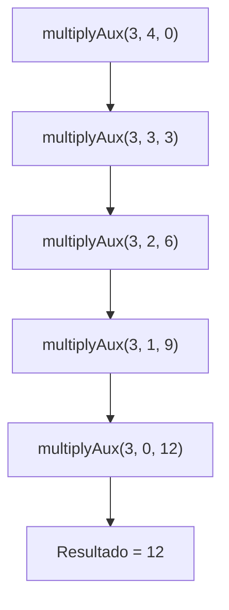

# Informe: Fast Algorithm

## 1. Contextualización
El **Fast Algorithm** presentado implementa la multiplicación de dos números enteros de manera recursiva utilizando la técnica de **recursión de cola** (*tail recursion*).  
El método descompone el problema de multiplicar `a × b` en sumas repetidas de `a`, reduciendo en cada llamada el valor de `b` hasta que este llega a cero.

Este enfoque, aunque menos eficiente que la multiplicación directa del lenguaje, es útil para comprender cómo funcionan las **funciones recursivas** y el manejo de la **pila de ejecución**.

---

## 2. Código

```scala
/**
* Clase del algoritmo Fast
*/
package taller1
import scala.annotation.tailrec

class FastAlgorithm  {
  def multiply(a:Int, b:Int): Int = {
    @tailrec
    def multiplyAux(a:Int, b:Int, acc:Int):Int = {
      if (b == 0) acc
      else multiplyAux(a, b - 1, acc + a)
    }
    multiplyAux(a, b, 0)
  }
}
```

---

## 3. Explicación matemática

El algoritmo implementa la siguiente definición recursiva de la multiplicación:

$$
a \times b =
\begin{cases}
0 & \text{si } b = 0, \\
a + (a \times (b - 1)) & \text{si } b > 0.
\end{cases}
$$

En el código, la variable `acc` actúa como acumulador para almacenar el resultado parcial de las sumas:

$$
\text{multiplyAux}(a, b, acc) =
\begin{cases}
acc & \text{si } b = 0, \\
\text{multiplyAux}(a, b - 1, acc + a) & \text{si } b > 0.
\end{cases}
$$

Ejemplo de cálculo:

Si queremos calcular $3 \times 4$:

$$
\begin{aligned}
\text{multiplyAux}(3, 4, 0) &= \text{multiplyAux}(3, 3, 3) \\
&= \text{multiplyAux}(3, 2, 6) \\
&= \text{multiplyAux}(3, 1, 9) \\
&= \text{multiplyAux}(3, 0, 12) \\
&= 12
\end{aligned}
$$

---

## 4. Estado de la pila (Mermaid)

Cuando se ejecuta la llamada recursiva para calcular $3 \times 4$, el estado de la pila evoluciona de la siguiente manera:



Este diagrama muestra cómo cada llamada recursiva reduce el valor de `b` y acumula el resultado en `acc` hasta llegar al caso base, donde se retorna el valor final.

---
