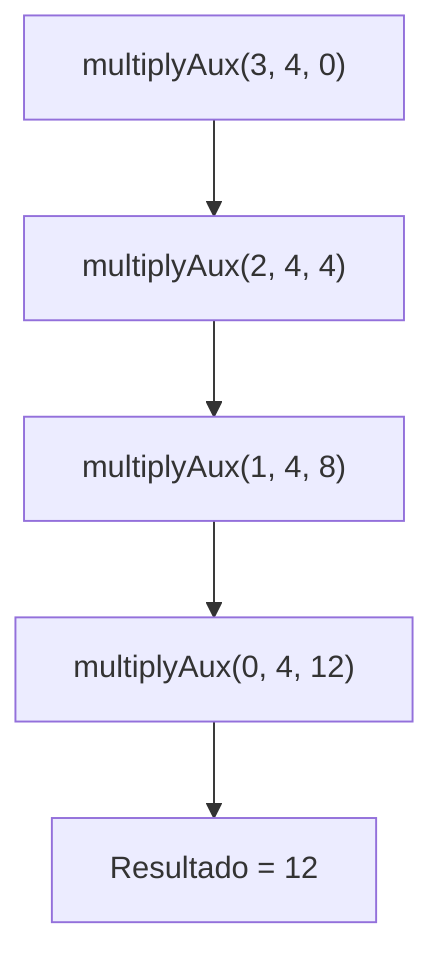

# Informe: Split Algorithm

## 1. Contextualización
El **Split Algorithm** implementa la multiplicación de dos números enteros utilizando **recursión de cola** (*tail recursion*).  
En este caso, la reducción se realiza sobre el parámetro `a`, acumulando sumas de `b` hasta que `a` se convierte en cero.

Este enfoque es un complemento al **Fast Algorithm**, ya que demuestra cómo la recursión puede adaptarse para disminuir distintos parámetros en el cálculo de la multiplicación.

---

## 2. Código

```scala
/**
 * Clase del algoritmo Split
 */
package taller1
import scala.annotation.tailrec

class SplitAlgorithm  {
  def multiply(a:Int, b:Int): Int = {
    @tailrec
    def multiplyAux(a:Int, b:Int, acc:Int):Int = {
      if (a == 0) {
        acc
      } else {
        multiplyAux(a - 1, b, acc + b)
      }
    }
    multiplyAux(a, b, 0)
  }
}
```

---

## 3. Explicación matemática

El algoritmo implementa la siguiente definición recursiva de la multiplicación:

\[
a \times b =
\begin{cases}
0 & \text{si } a = 0, \\
b + ((a - 1) \times b) & \text{si } a > 0.
\end{cases}
\]

En el código, la variable `acc` almacena la suma parcial, mientras que `a` se reduce en cada paso:

\[
\text{multiplyAux}(a, b, acc) =
\begin{cases}
acc & \text{si } a = 0, \\
\text{multiplyAux}(a - 1, b, acc + b) & \text{si } a > 0.
\end{cases}
\]

Ejemplo de cálculo:

Si queremos calcular \( 3 \times 4 \):

\[
\begin{align}
\text{multiplyAux}(3, 4, 0) &= \text{multiplyAux}(2, 4, 4) \\
&= \text{multiplyAux}(1, 4, 8) \\
&= \text{multiplyAux}(0, 4, 12) \\
&= 12
\end{align}
\]

---

## 4. Estado de la pila (Mermaid)

Cuando se ejecuta la llamada recursiva para calcular \( 3 \times 4 \), el estado de la pila evoluciona de la siguiente manera:



Este diagrama muestra cómo cada llamada recursiva reduce el valor de `a` y acumula el resultado en `acc` hasta llegar al caso base.

---
